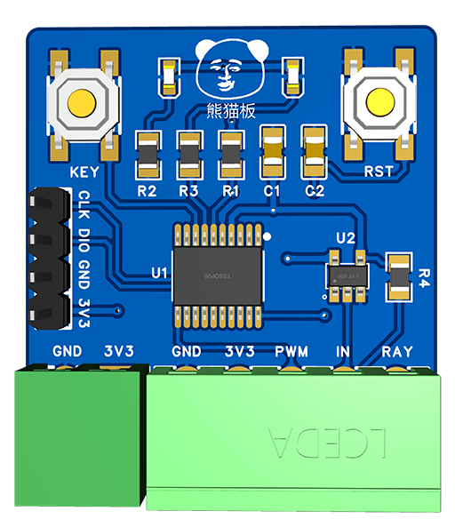

# 太阳能照明

白天太阳能板发电给储能电池充电，夜晚自动使用储存的电驱动 LED 照明。

## 引脚说明

### 左侧接线端子

| Pin | Mode | Description |
| --- | --- | ----------- |
| GND | 输入 | 接地 |
| 3V3 | 输入 | 接电源 |

### 右侧接线端子

| Pin | Mode | Description |
| --- | --- | ----------- |
| GND | 输入 | 接地 |
| 3V3 | 输出 | 接驱动 |
| PWM | 输出 | LED 控制，使用呼吸灯方式调光 |
| IN  | 输入 | 接太阳能正极(3V3) |
| RAY | 输入 | 接人体红外感应器 |
